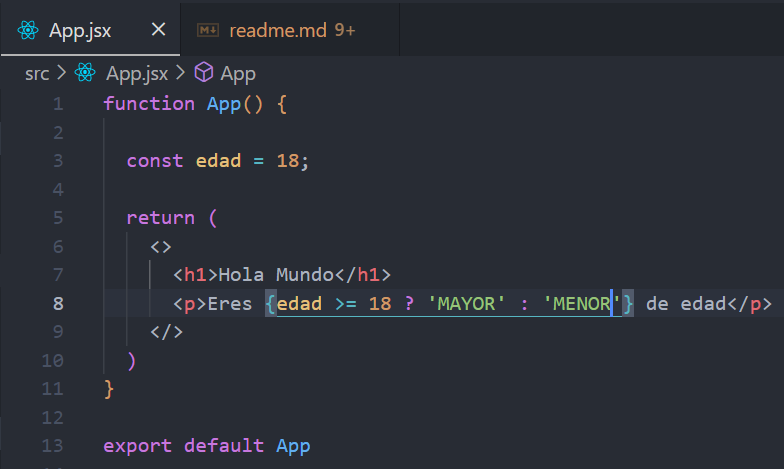

# VITE Y CONFIGURACION INICIAL DEL PROYECTO
---

Este proyecto usa vite. Un programa que ayuda a la configuracion inicial de proyectos que usan frameworks react, vue, svelte, etc.

Para instalar la ultima version:

    npm init vite@latest

Nos pide:
- Nombre del proyecto: citas-react 
- Framework: react
- Variante de framework: react

Una vez terminado genera la estructura del proyecto básico react. Para arrancar el proyecto, entreamos a la carpeta del proyecto

    cd citas-react
    npm install

# ARRANCAR EL PROYECTO
---

Para arrancar el proyecto desde esa misma ruta se ejecuta:

    npm run dev

Como puede verse en el package.json

# JSX
---

Es una extension del lenguaje desarrollada por Facebook para React. 

Es un lenguaje de template que muestra el HTML pero tiene todas las funciones de Javascript.

Una vez compilado el jsx se conviente a js.

- Las funciones deben tener return
- Cuidado con los cierresde etiquetas.
- Solo puede devolver un elemento, no un conjunto. A menos que lo introduzcas en un div u otro elemento contenedor. En react tenemos los denominados fragments que es lo mismo que un div pero sin el nombre:

# 2 partes de jsx
---
Antes del return y despues.
### ANTES:
- Se pueden crear funciones

### DESPUES:
- Es la parte visual (HTML)
- No se pueden crear funciones
- Para hacer if solo ternarias y se usan {} para indicar que es js.

# CREAMOS NUESTRO PRIMER COMPONENTE:
---
Creamos la carpeta __components__ dentro de scr donde crearemos todos nuestros componentes.

Vamos a crear el componente Header. Un componente es una funcion. Para ello creamos el componente con la primera letra en mayuscula tanto en el nombre del fichero como en la funcion y debe ser de tipo jsx: 

    Header.jsx

Creamos el componente (la funcion) con su return y su export para poder importarlo desde otros componentes.

Importamos el componente Header desde el App.jsx y lo usamos en su HTML con la etiqueta 

    <Header></Header> o <Header/>

# EXTENSIONES UTILES PARA VS CODE Y REACT:

- AUTO RENAME TAG
- Tailwind CSS intelliSen
- css peek
- ES7+ REACT/REDUX ...
  - COMANDOS ES7
    - rfce

# EXTENSION CHROME
- REACT DEVELOPER TOOLS

# FORMAS DE USAR CSS EN REACT
- CSS Plano
- Frameworks CSS
- Modulos CSS
- TAILWIN CSS
- SASS
- ...

# Instalacion Tailwind CSS
https://tailwindcss.com/

    # Instalacion
    npm i -D tailwindcss postcss autoprefixer

    # Archivos configuracion
    npx tailwindcss init -p

Al ejecutar el comando anterior se crean dos ficheros de configuracion:
- postcss.config.cjs
- tailwind.config.cjs

Añadimos al archivo index.css los paquetes de configuracion de tailwindcss

    @tailwind base;
    @tailwind components;
    @tailwind utilities;

### Configurando tailwind.config.cjs

Modificamos el content para decirle los archivos que necesitaran de los paquetes de tailwind. Para ello le diremos que lo necesita el index.html y todos los elementos .jsx de las carpetas dentro de src.

    content: ["./index.html", "./src/**/*.jsx"],

Como hemos cambiado configuracion lo mejor es parar el servidor y volver a arrancarlo.

Una vez arrancado, desaparecen todos los estilos. Aunque tengan diferentes etiquetas tailwindcss los quita todos.

Para dar formato a los elementos html:
Si lo hacemos en HTML se usa __class__.
Si lo hacemos en JSX se usa la propiedad __className=__

# HOOKS
---
Los hooks son funciones propias de react que ayudan con el desarrollo. El estado de los componentes por ejemplo. Podemos crear nuestros propios hooks.

### Se dividen en:

__BASICOS:__
- useState: Estado
- useEffect
- useContext

__ADICIONALES:__
- useReducer
- useCallback
- useMemo
- useRef
- useImperativeHandle
- useLayoutEffect
- useDebugValue

# USESTATE
---

React reacciona en funcion del state. cada vez que cambia el state, la aplicacion se va a Renderizar y actualizar con los cambios.

importamos en Hook necesario para usar el state:

    import { useState } from 'react'

**Variable paciente:**
    
    paciente -> es el nombre de la variable
    setPaciente -> es la funcion modificadora
    el valor pasado al useState() es el valor inicial:
    objeto vacio: {}
    array vacio: []
    etc
    const [paciente, setPaciente] = useState({});

**Variable total:**

    const [total, setTotal] = useState(0);

**Arreglo de pacientes:**
    
    const [pacientes, setPacientes] = useState([]);

El state de una variable solo debe cambiarse mediante el uso de la funcion modificadora. NO POR ASIGNACION. La asignacion no dispara el cambio de estado.

Los hooks tiene que ir dentro de la funcion del componente, pero no puede ir dentro de un condicional. Siempre tiene que haber el mismo numero de hooks. No se puede crear una variable de estado en funcion de una condicion.

# EVENTOS DE REACT

Para poder recoger el valor introducido en el nombre del formulario y meterlo dentro del state, usaremos el evento __onChange()__ de react.

Como habiamos visto antes creamos la variable nombre en el state:

    const [nombre, setNombre] = useState('');

Ahora añadimos las siguientes lineas al input:

- __Value:__ añade el valor que tenga la variable inicialmente y si cambia

- __onChange:__ llama a la funcion modificadora de la variable de estado nombre, setNombre pasandole el valor introducido en el input.

---
    <input
        id="mascota"
        type="text"
        className="border-2 w-full p-2 mt-2 placeholder-gray-400 rounded-md"
        placeholder="Nombre de la mascota"
        value={nombre}
        onChange={ (e) => setNombre(e.target.value) }
    />

Todos los eventos de js los tiene tambien react. La diferencia es que tiene camelCase. onchange = onChange y asi sucesivamente.

Tambien podemos crear funciones a las que llamar.

# TERNARIA CON UNA OPCION

Si error es true muestra el siguiente texto:

    { error && 'Si hay un error' }
    
Otro ejemplo complicandolo un poco. Si error entonces muestra el div:

    {error && (
        

        
Todos los campos son obligatorios

        

    )}

# PROPS

Los props son una forma de pasar variables (state, ...) o funciones de un componente a otro.
Los props siempre se pasan del padre al hijo.

Si queremos que el hijo mande al padre lo creamos en el padre, se lo envia al hijo y al cambiarlo el hijo lo cambia el padre.

En nuestro ejemplo tenemos que comunicar los pacientes entre el listado y el formulario. Como los necesitamos en los dos sitios lo ponemos en el padre de los dos App y se los pasamos como prop.

__props__ es una palabra reservada de react.

Pasaremos desde el componente App al formulario tanto la variable de estado de los pacientes(un listado de pacientes) como la funcion modificadora del listado.

Ahora los recuperamos en el componente Formulario. Podriamos pasarle props(palabra reservada) y coger cada propiedad pero en este caso vamos a haces destructuring como vemos en la imagen. El

Tambien vemos como creamos un objeto que contenga los valores del formulario.

Por ultimo podemos ver como usamos el operador spreadOperator para crear un nuevo array con los datos del array anterior de pacientes mas el nuevo paciente. De esta forma no modificamos la variable pacientes sino que usamos la funcion modificadora. No se puede hacer un push().

# CHILDREN: OTRA FORMA DE PASAR LOS PROPS

La palabra children esta reservada en react. Sirve para todo lo que se le pase a un componente. Es util cuando quieres pasar varios eleentos HTML.
Ejemplo uso normal:

Error.jsx

    function Error({ mensaje }) {
        return (
            

            
{mensaje}

            

        );
    }
    export default Error;

En Formulario.jsx

    <Error mensaje="Todos los campos son obligatorios"/>

**Con children:**

Error.jsx

    function Error({ children }) {
        return (
            

            
{children}

            

        );
    }
    export default Error;

En Formulario.jsx

    <Error>Todos los campos son obligatorios</Error>

# LISTADO

Un listado siempre tiene que tener una clave unica. Si no lo tiene se mostrara un error por consola. No es una buena practica usar el index como key de un listado.

Para solucuinarlo podemos usar el id de base de datos, pero si no tenemos base de datos, podemos crear un id de la siguiente manera:

**Formulario.jsx**

    const generarId = () => {
        const random = Math.random().toString(36).substring(2);
        const fecha = Date.now().toString(36).substring(2);
        return random + fecha;
    }

Y luego podemos añadirlo al paciente:

    // Creamos un obj paciente con los datos del formulario
    const pacienteNuevo = {
      nombre,
      propietario,
      email,
      alta,
      sintomas,
      id: generarId()
    };

y solo queda usarlo en el **ListadoPacientes** mediante el uso de key:

    { pacientes.map(paciente => 
        <Paciente 
            key={paciente.id}
            paciente={paciente} 
        />
    )}
